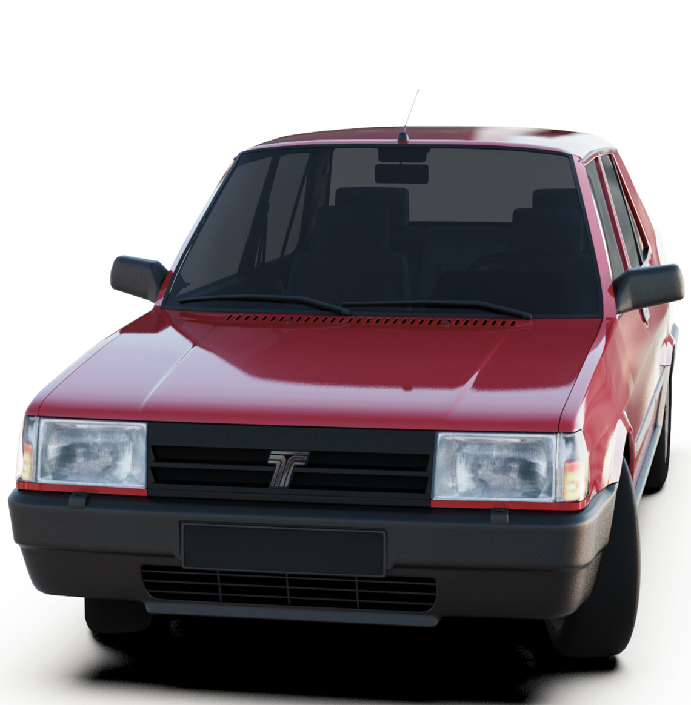
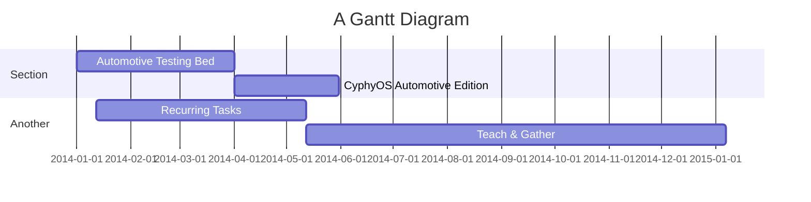

# ASRG-ANK
Automotive Security Research Group - ANKARA




Understanding CAN Network
===


## Table of Contents

[TOC]

## Controller Area Network

Controller Area Network (CAN) bus is a widely used communication protocol in the automotive industry for interconnecting various electronic control units (ECUs) within a vehicle. It enables real-time data exchange and coordination among different vehicle systems, such as engine control, transmission control, anti-lock braking systems, and more. This technical summary delves into the operational principles of CAN bus and provides examples of its applications in the automotive domain.

Before CAN, various electronic components in a vehicle were hardwired with a complex wiring harness. This caused both extensive copper usage with complex web of cables also very hard to troubleshoot and fix any potential wiring issues.

Basically CAN is a type of serial communication which works in real time. It has a distributed control mechanism. It has been developed in order to replace the complex wiring harness to a 2-wire Bus architecture.

* CAN Uses Differential Signaling (like:RS485) and its 120ohm Bus Terminated.
* It Has a Framing Structure. OSI L2 with CSMA/CD error correction. (like:UART)
* Multimaster, Message Based, Prioritized (like:QoS, VLAN).
* Theoratically = 1Mb/s and Max Range is 40meters.
* BOSCH Did the original development in mid 80's (Synth-era)
* Not wiring everything reduced the complexity and the cost.
* First car with CAN was Mercedes W140 - 1991.
* In 1991 Bosch improved the CAN and released CAN2.0 A & B HighSpeed.
* CAN2.0A 11 Bit Address Where B is 29 Bit Addr.Field.
* ISO 11898 CAN High Speed 125kbps-1Mbps
* ISO 11519 CAN Low Speed < 125kbps
* Each CAN Unit connected to the BUS called a node.
* All CAN units bus terminated 120ohm resistor.
* Bus termination Counteracts impedance of power bus.
* Most signaling issues are related to exessive bus impadence.
* BUS Consists of 2 Wires; CAN_H and CAN_L.
* They have two states, Dominant and Recessive.
* It has different network segments

UART,SPi or i2c cannot work on cars.
CAN_FD
CAN Open
J1939
LIN Bus - Local Interconnect Network
LIN is supplement to CAN


CAN Bus Operation
---
CAN bus operates on a multi-master, broadcast-oriented, and event-driven communication architecture. It employs a differential signaling mechanism to transmit data over twisted-pair wiring. The key components of CAN bus operation include:


### Message Format

CAN messages consist of an identifier, data, and other control bits. The identifier determines the priority of the message. Standard CAN uses 11-bit identifiers (CAN 2.0A), while Extended CAN uses 29-bit identifiers (CAN 2.0B). The data field contains the actual information being transmitted.


### Arbitration
Multiple ECUs on the bus can transmit messages simultaneously. To prevent collisions, CAN bus uses a bitwise arbitration process based on the identifiers. A "dominant" bit (0) overrides a "recessive" bit (1). The ECU with the lowest identifier and the dominant bit wins arbitration and gains bus access.


### Bit Timing and Synchronization
CAN bus uses non-return-to-zero (NRZ) encoding. It synchronizes the participating ECUs using bit timing parameters like bit time, sample points, and phase segments. This ensures accurate data reception.

### Error Detection and Handling
CAN employs a cyclic redundancy check (CRC) mechanism for error detection. If a receiving ECU identifies an error, it sends an error flag, and the transmitting ECU will retransmit the message.

### Bus Topology
CAN bus has a linear topology where ECUs are connected sequentially. Termination resistors at both ends of the bus help prevent signal reflections.


Examples of CAN Bus Applications in Automotive
---

#### Engine Control Unit (ECU)
The ECU manages the engine's performance by controlling fuel injection, ignition timing, and emission systems. It communicates with sensors (temperature, throttle position, etc.) via CAN bus to optimize engine parameters in real time.

#### Anti-lock Braking System (ABS)
ABS uses data from wheel speed sensors to prevent wheel lock during braking. The ABS ECU communicates with these sensors over CAN bus to adjust braking pressure and maintain vehicle stability.

#### Transmission Control Unit (TCU)
The TCU manages the vehicle's transmission system based on inputs like speed, load, and driver behavior. CAN bus connects the TCU to various sensors, enabling smooth gear shifts and optimal performance.

#### Airbag System
In the event of a collision, impact sensors send data to the airbag control module via CAN bus. This module then triggers the deployment of airbags to protect passengers.

#### Infotainment System
CAN bus supports infotainment systems by transmitting audio, video, and control data between the head unit, navigation system, and speakers.

CAN Packet Structure and Technical Details
---
1. CAN Message Format:

    A CAN packet, often referred to as a "**frame**," consists of several fields that define the message's content, priority, and control information. ***Start of Frame (SOF)***: A dominant bit (0) marks the start of the frame.
    
    Arbitration ID (**CAN Identifier**): This field holds the message's identifier, which determines its priority on the bus. Standard CAN uses 11 bits (CAN 2.0A), while Extended CAN uses 29 bits (CAN 2.0B).
    
    Remote Transmission Request (**RTR**) Bit: In a data frame, this bit indicates whether the message is a data frame (RTR = 0) or a remote frame requesting data (RTR = 1).
    
    Control Bits: These include bits like the Identifier Extension Bit (**IDE**) and the Extended Frame Format Bit (**EFF**) that differentiate between standard and extended frames.
    
    Data Length Code (**DLC**): This field specifies the number of bytes in the data field (0 to 8 bytes).
    
    Data Field: Contains the actual data being transmitted (0 to 64 bits).
    
    Cyclic Redundancy Check (**CRC**): A 15- or 17-bit field used for error detection.
    
    ACK Slot and ACK Field: **ACK** slot allows the transmitter to detect whether its message was acknowledged by other ECUs. ACK field carries acknowledgment bits from receiving ECUs.
    
    End of Frame (**EOF**): Marks the end of the frame transmission.

2. CAN Packet Transmission:

    Bit Timing: CAN bus defines the timing parameters, including bit time, propagation time, and phase segments. These parameters ensure synchronization between transmitting and receiving ECUs.

    Bit Stuffing: To maintain synchronization, if a transmitter sends five consecutive bits of the same value, it inserts a bit of the opposite value. The receiver removes these stuffed bits.

    Arbitration: During message transmission, if multiple ECUs start transmitting simultaneously, the one with the lowest identifier and dominant bit(s) wins arbitration and continues transmitting. Other ECUs detect the dominant bit(s) and stop transmitting.

    Error Handling: CAN bus can detect errors like bit errors, CRC errors, and acknowledgment errors. Error flags are raised, and the transmitting ECU retries the message.

3. CAN Message Types:
Data Frame: Carries actual data and is the most common type of CAN frame.
Remote Frame: Requests data from a specific ECU. The identifier signals other ECUs to respond with the requested data.
Error Frame: Sent by an ECU detecting an error in the message.
Overload Frame: Used to delay the transmission of high-priority messages during bus congestion.

4. CAN Bus Topology and Termination:
CAN bus is a multi-drop bus, typically using a linear topology.
Bus terminators with resistance values close to the characteristic impedance of the bus cable are placed at both ends of the bus to prevent signal reflections.

5. CAN Bit Rates:
CAN bus supports various bit rates, typically ranging from 10 kbps to 1 Mbps.
Higher bit rates allow faster data transmission but may be susceptible to signal integrity issues over longer bus lengths.

6. Examples of CAN Packet Formation:
    Example 1: Standard Data Frame

        SOF (1 bit)
        Identifier (11 bits)
        RTR (1 bit)
        IDE (1 bit)
        DLC (4 bits)
        Data Field (0-64 bits)
        CRC (15 bits)
        ACK Slot (1 bit)
        ACK Field (2 bits)
        EOF (7 bits)
    Example 2: Extended Data Frame

        SOF (1 bit)
        Identifier (29 bits)
        RTR (1 bit)
        IDE (1 bit)
        EFF (1 bit)
        DLC (4 bits)
        Data Field (0-64 bits)
        CRC (15 bits)
        ACK Slot (1 bit)
        ACK Field (2 bits)
        EOF (7 bits)

## To be Detailed
ELM327
CAN High/Low
OBD Commands

	

03	Diagnostic Trouble Codes
04	Clear Trouble Code
05	Test Results/Oxygen Sensors
06	Test Results/Non-Continuous Testing
07	Show Pending Trouble Codes
08	Special Control Mode
09	Request Vehicle Information
0A	Request Permanent Trouble Codes

| Mode Number | Mode Description |
| -------- | -------- |
|01| Current Data |
|02|Freeze Frame Data|


Request Fuel System Status (AT@03):
Scenario: Understanding the status of the fuel system can help diagnose fuel-related issues, but it can also reveal information about fuel efficiency and usage.

Request O2 Sensor Data (AT@14):
Scenario: O2 sensor data can provide insights into the air-fuel ratio and emissions. Security professionals can analyze this data to identify potential performance or environmental issues.

Request Diagnostic Trouble Codes (AT@03):
Scenario: Retrieving diagnostic trouble codes (DTCs) can help identify specific vehicle problems. Security experts can explore how vulnerabilities in accessing and clearing DTCs might impact vehicle diagnostics.

Request Vehicle Speed (AT@0D) (Already included):
Scenario: Monitoring vehicle speed can reveal sensitive information about a vehicle's location and driving behavior. It's crucial for security professionals to understand the privacy implications.

Request Engine RPM (AT@0C) (Already included):
Scenario: Analyzing engine RPM data can provide insights into a vehicle's performance. Security experts can explore how this data might be exploited or manipulated for malicious purposes.

Request Vehicle Identification Number (VIN - AT@1) (Already included):
Scenario: Accessing the Vehicle Identification Number (VIN) is crucial for vehicle identification and can be used to verify the authenticity of a vehicle. Security professionals should understand how protecting the VIN is essential for preventing fraud.

Request Ignition Timing (AT@0E):
Scenario: Ignition timing data can impact engine performance. Security experts can assess potential risks associated with unauthorized access or tampering with ignition timing.

Request Throttle Position (AT@11) (Already included):
Scenario: Throttle position data can reveal driver behavior and performance characteristics. Security professionals can examine how this information might be exploited for tracking or profiling.

Request Intake Air Temperature (AT@0F) (Already included):
Scenario: Understanding the intake air temperature is important for engine efficiency. Security experts can investigate how manipulating this data might affect engine performance or emissions.

Request Vehicle Battery Voltage (AT@ATRV):
Scenario: Battery voltage data can be critical for monitoring a vehicle's electrical system health. Security professionals can explore potential vulnerabilities related to battery-related data access.

Request Timing Advance (AT@0E):
Scenario: Timing advance data is related to ignition timing and engine performance. Security professionals can examine how unauthorized changes might impact engine operation.

Request Absolute Throttle Position (AT@0B):
Scenario: Absolute throttle position data provides insights into the throttle's opening degree. Security experts can analyze potential risks if this data is accessed or altered.

Request Ambient Air Temperature (AT@46):
Scenario: Ambient air temperature can affect engine performance and efficiency. Security professionals can investigate potential implications if this data is manipulated.

## Appendix and FAQ

:::info
**Find this document incomplete?** Leave a comment!
:::
>Sparkfun OBD2 To UART Shield: https://learn.sparkfun.com/tutorials/obd-ii-uart-hookup-guide/all

> Without knowing the known, you cannot deal with unknown. [name=Mustafa Shelim PASHA]


###### tags: `Templates` `Documentation`

PoC Python Code
---
```python=
import serial
import time
import random
import csv
import can
from datetime import datetime
import threading

# Define the serial port and baud rate for your OBD2 to UART device
ser = serial.Serial('/dev/ttyUSB0', baudrate=115200, timeout=1)

# Define the CSV file for logging AT command responses
at_log_filename = "obd2_at_log.csv"

# Define the CSV log file for CAN traffic
can_log_filename = "can_traffic_log.csv"

# Flag to control the CAN traffic capture thread
capture_can_traffic = False

def send_at_command(command):
    ser.write((command + '\r').encode())
    time.sleep(0.1)  # Wait for the device to respond
    response = ser.read(ser.in_waiting).decode().strip()
    return response

def log_can_traffic(bus):
    global capture_can_traffic
    entry_id = 1

    # Initialize CAN log file
    with open(can_log_filename, mode='w', newline='') as can_log_file:
        can_log_writer = csv.writer(can_log_file)
        can_log_writer.writerow(["Entry ID", "Timestamp", "ID", "Data"])

    while capture_can_traffic:
        message = bus.recv()
        timestamp = datetime.now().strftime("%Y-%m-%d %H:%M:%S.%f")
        can_id = message.arbitration_id
        can_data = ' '.join([hex(byte)[2:].zfill(2) for byte in message.data])

        # Log CAN traffic to the CSV file
        with open(can_log_filename, mode='a', newline='') as can_log_file:
            can_log_writer = csv.writer(can_log_file)
            can_log_writer.writerow([entry_id, timestamp, can_id, can_data])

        entry_id += 1

def start_can_traffic_capture():
    global capture_can_traffic
    capture_can_traffic = True

    # Start capturing CAN traffic in a separate thread
    can_bus = can.interface.Bus(channel='can0', bustype='socketcan')
    can_capture_thread = threading.Thread(target=log_can_traffic, args=(can_bus,))
    can_capture_thread.start()

def stop_can_traffic_capture():
    global capture_can_traffic
    capture_can_traffic = False

try:
    # Open the serial connection
    ser.open()

    if ser.is_open:
        print("Serial port is open.")

        # Initialize AT command log file
        with open(at_log_filename, mode='w', newline='') as at_log_file:
            at_log_writer = csv.writer(at_log_file)
            at_log_writer.writerow(["Entry ID", "Timestamp", "Request", "Raw Response", "Decoded/Stripped Response"])

        while True:
            # Prompt the user to choose an option
            print("Select an option:")
            print("1. Send a specific AT command")
            print("2. Request the vehicle VIN (AT@1)")
            print("3. Request vehicle speed (AT@0D)")
            print("4. Request engine RPM (AT@0C)")
            print("5. Request coolant temperature (AT@05)")
            print("6. Fuzz the CAN network with random AT commands")
            print("7. Start listening and logging CAN traffic")
            print("8. Stop listening and return to main menu")
            print("9. Request throttle position (AT@11)")
            print("10. Request intake air temperature (AT@0F)")
            print("11. Request MAF air flow rate (AT@10)")
            print("q. Quit")

            choice = input("Enter your choice (1/2/3/4/5/6/7/8/9/10/11/q): ")

            if choice == 'q':
                break
            elif choice == '1':
                at_command = input("Enter AT command: ")
            elif choice == '2':
                at_command = "AT@1"
            elif choice == '3':
                at_command = "AT@0D"
            elif choice == '4':
                at_command = "AT@0C"
            elif choice == '5':
                at_command = "AT@05"
            elif choice == '6':
                # Generate a random AT command for fuzzing
                at_command = "AT@" + ''.join(random.choice('0123456789ABCDEF') for _ in range(2))
            elif choice == '7':
                # Start capturing CAN traffic
                start_can_traffic_capture()
                print("Listening to CAN traffic. Press 8 to stop and return to the main menu.")
                continue
            elif choice == '8':
                # Stop capturing CAN traffic
                stop_can_traffic_capture()
                print("Stopped listening to CAN traffic.")
                continue
            elif choice == '9':
                at_command = "AT@11"  # Request throttle position
            elif choice == '10':
                at_command = "AT@0F"  # Request intake air temperature
            elif choice == '11':
                at_command = "AT@10"  # Request MAF air flow rate
            else:
                print("Invalid choice. Please select a valid option.")
                continue

            # Send the AT command and get the response
            response = send_at_command(at_command)

            # Get the current timestamp
            timestamp = datetime.now().strftime("%Y-%m-%d %H:%M:%S")

            # Log the request and response to the AT command log file
            with open(at_log_filename, mode='a', newline='') as at_log_file:
                at_log_writer = csv.writer(at_log_file)
                at_log_writer.writerow([entry_id, timestamp, at_command, response, response.encode().hex()])

            # Print the request and response to the console
            print(f"Entry ID: {entry_id}")
            print(f"Timestamp: {timestamp}")
            print(f"Request: {at_command}")
            print(f"Raw Response: {response.encode().hex()}")
            print(f"Decoded/Stripped Response: {response}")

except Exception as e:
    print(f"An error occurred: {str(e)}")

finally:
    # Close the serial connection
    ser.close()
    print("Serial port is closed.")


```


Project Timeline
---


> Read more about mermaid here: http://mermaid-js.github.io/mermaid/

```C=
Exploit In C
--- temp_shell.c
#include <sys/types.h>
#include <sys/socket.h>
#include <sys/ioctl.h>
#include <net/if.h>
#include <netinet/in.h>
#include <linux/can.h>
#include <string.h>
int main(int argc, char *argv[]) {
int s;
struct sockaddr_can addr;
struct ifreq ifr;
struct can_frame frame;
s = socket(➊PF_CAN, SOCK_RAW, CAN_RAW);
strcpy(ifr.ifr_name, ➋"vcan0");
ioctl(s, SIOCGIFINDEX, &ifr);
addr.can_family = AF_CAN;
addr.can_ifindex = ifr.ifr_ifindex;
bind(s, (struct sockaddr *)&addr, sizeof(addr));
➌ frame.can_id = 0x510;
frame.can_dlc = 8;
frame.data[1] = 0xFF;
while(1) {
write(s, &frame, sizeof(struct can_frame));
➍ usleep(500000);
}
}
```
To be Continued Later @ 13.12.2023
